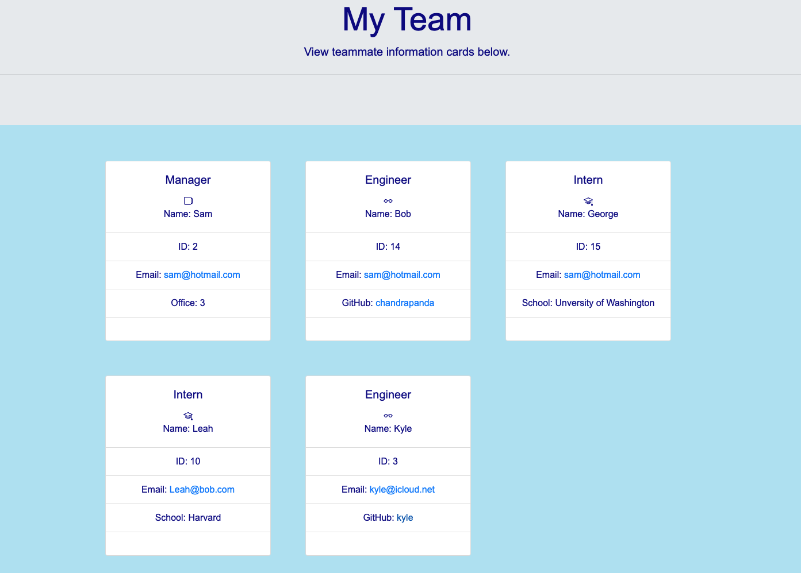
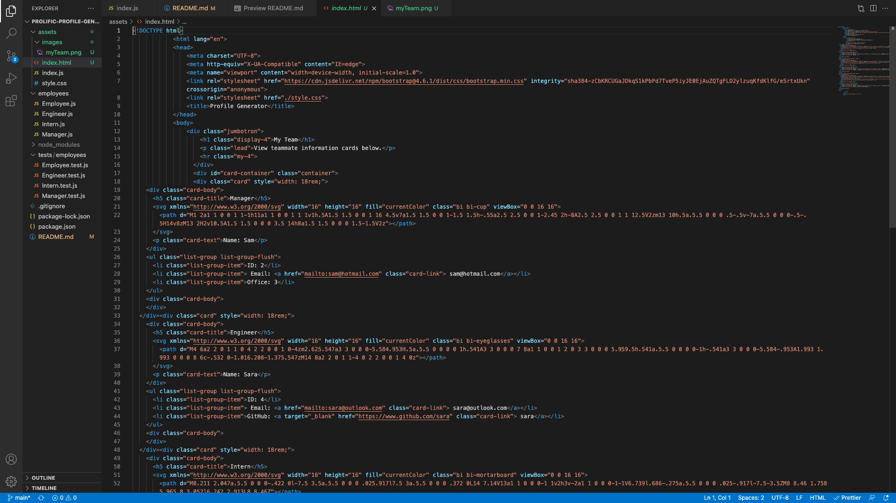
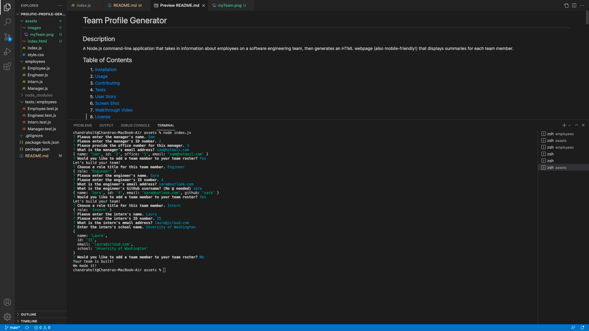

# Team Profile Generator

## Description
A Node.js command-line application that takes in information about employees on a software engineering team, then generates an HTML webpage (also mobile-friendly!) that displays summaries for each team member.
## Table of Contents
1. [Installation](#installation) 
2. [Usage](#usage)
3. [Contributing](#contributing)
4. [Tests](#tests)
5. [User Story](#criteria)
6. [Screen Shots](#screenshots)
7. [Walkthrough Video](#walkthrough)
8. [License](#license)

## Installation 
Install 'inquirer' and 'jest' 
## Usage 
Software engineers can use this handy application to generate informative cards about each employee on their team. The team member's GitHub and email is accessible easily through links on their cards as well.
## Contributing 
Project created by Chandra Holt
## Tests 
Four separate tests were constructed to test the functionality of each method for classes used in this application. Each test references the JS files relevant to classes and sub-classes of employees on the team. Examples were provided in each test to ensure that the answers being passed through and returned to multiple functions returned correctly in the end in order to create the new HTML file.
## Questions
## GitHub
[GitHub](https://www.github.com/chandrapanda) 
### Email
chandra_holt@hotmail.com

  ## Criteria

```md
GIVEN a command-line application that accepts user input
WHEN I am prompted for my team members and their information
THEN an HTML file is generated that displays a nicely formatted team roster based on user input
WHEN I click on an email address in the HTML
THEN my default email program opens and populates the TO field of the email with the address
WHEN I click on the GitHub username
THEN that GitHub profile opens in a new tab
WHEN I start the application
THEN I am prompted to enter the team manager’s name, employee ID, email address, and office number
WHEN I enter the team manager’s name, employee ID, email address, and office number
THEN I am presented with a menu with the option to add an engineer or an intern or to finish building my team
WHEN I select the engineer option
THEN I am prompted to enter the engineer’s name, ID, email, and GitHub username, and I am taken back to the menu
WHEN I select the intern option
THEN I am prompted to enter the intern’s name, ID, email, and school, and I am taken back to the menu
WHEN I decide to finish building my team
THEN I exit the application, and the HTML is generated
```

## User Story

```md
AS A manager
I WANT to generate a webpage that displays my team's basic info
SO THAT I have quick access to their emails and GitHub profiles
```

## Screenshots




## Walkthrough
[Video](https://watch.screencastify.com/v/KJ9MBToKMmq0ohRYAmZ5)

## License 
  [](https://opensource.org/licenses/MIT)
  [This application is licensed under MIT](https://opensource.org/licenses/MIT)